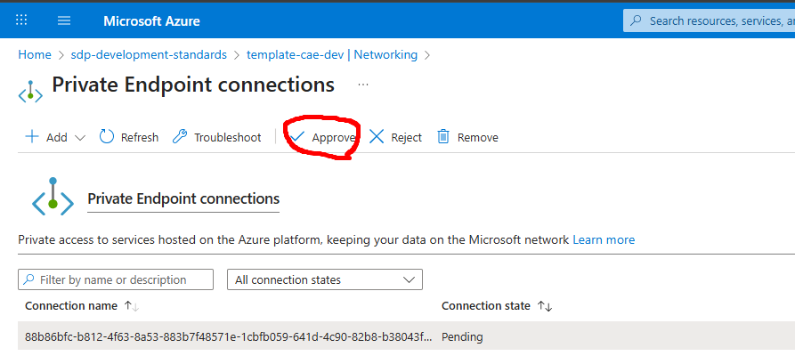

# ドキュメント

## サービス構成


## Azure デプロイ

1,2 については [init.sh](../iac/init.sh) で省略可能

### 1. リソースグループと ACR の作成

1. Azure CLI のログイン
    ```bash
    az login
    ```
1. リソースグループの作成
    ```bash
    az group create --location japaneast -n <リソースグループ名>
    ```
1. Azure Container Registry (ACR) の作成
    * [management.bicepparam](../iac/management.bicepparam) パラメタの更新
        * acr_name : ACR のリソース名
    * [management.bicep](../iac/management.bicep) をデプロイする
      ```bash
      az deployment group create --resource-group <リソースグループ名> --name <デプロイ名> --parameters iac/management.bicepparam
      ```

### 2. CI/CD 用のアプリ登録

1. アプリケーションの登録
    ```bash
    az ad app create --display-name <アプリケーション名>
    ```
1. サービスプリンシパルの作成
    ```bash
    az ad sp create --id <登録アプリの appId>
    ```
    * appId はアプリケーションの登録コマンド実行時に返却される JSON の `appId`
1. 必要な IAM の付与
    * Resource Group : Contributor
      Azure リソースの作成、変更に必要
    * Container Registry : AcrPush, User Access Administrator(Assignable roles: AcrPull)
      ビルドした Docker Image を ACR にプッシュするため、および払い出したサービスに ACR のプル権限を付与するため
1. フェデレーション資格情報の追加
    * credential.json を作成
      ```json
      {
          "name": "<任意の認証名>",
          "issuer": "https://token.actions.githubusercontent.com",
          "subject": "repo:<GithubのOrganization/Repository>:ref:refs/heads/*",
          "description": "<認証の詳細>",
          "audiences": [
              "api://AzureADTokenExchange"
          ]
      }
      ```
      * subject の詳細は [GitHub Docs](https://docs.github.com/ja/actions/concepts/security/about-security-hardening-with-openid-connect#example-subject-claims) を参考に GitHub Actionのトリガー要因となるものを設定する
      * サンプル:[credential.json](../iac/configurations/credential.json)
    * コマンドの実行
      ```bash
      az ad app federated-credential create --id <アプリケーションの objectId> --parameters credential.json
      ```
      * アプリケーションの objectId はアプリケーションの登録コマンド実行時に返却される JSON の `id`

### 3. Github シークレットの作成

1. GitHub リポジトリのシークレット設定
    * Repository secrets に以下のシークレット値を設定する
      (init.sh を使った場合は実行結果に値が出力されます)
        * AZURE_CLIENT_ID
        * AZURE_TENANT_ID
        * AZURE_SUBSCRIPTION_ID
        * AZURE_REGISTRY_NAME

### 4. アプリケーションのビルド

1. Github Action `App Build` を実行

### 5. Entra ID 認証用のアプリ登録

1. アプリケーションの登録
    ```bash
    az ad app create --display-name <アプリケーション名>
    ```
1. シークレットの作成
    ```bash
    az ad app credential reset --id <登録アプリの appId> --append
    ```

### 6. アプリケーションと関連リソースのデプロイ

1. GitHub リポジトリのシークレット設定
    * RESOURCE_GROUP
    * POSTGRES_USER
    * POSTGRES_PASSWORD
    * AZURE_AD_CLIENT_ID
    * AZURE_AD_TENANT_ID
    * AZURE_AD_CLIENT_SECRET
    * NEXTAUTH_SECRET
1. Github Action `App Deploy` を実行
    * option
      * base - 基本構成
      * waf - WAF 構成
    > __Warning__  
    > 基本構成以外の指定を行った場合、初回デプロイで失敗します。
    > 後続の処理を行って再度デプロイを実施することでデプロイが完了します。
1. (基本構成以外) Front Door から Container App Envorinment への Plivate Link の承認を行い、再度 GitHub Action `App Deploy` を実行
  

### 7. 認証用アプリにリダイレクト URL を登録

```bash
az ad app update --id <登録アプリの appId> --web-redirect-uris <フロントエンドアプリケーションの URI>/api/auth/callback/azure-ad
```
* フロントエンドアプリケーションの URI
  * 基本構成の場合は Container App の URI を指定する
  * WAF 構成の場合は Front Door の エンドポイント URI を指定する

## ローカルデバッグ

1. 認証用アプリに localhost URL を登録
1. [docker-compose.yml](../docker-compose.yml) に認証用の環境変数を設定
    * AZURE_AD_CLIENT_ID
    * AZURE_AD_CLIENT_SECRET
    * AZURE_AD_TENANT_ID
1. 起動
    ```bash
    docker compose up
    ```
